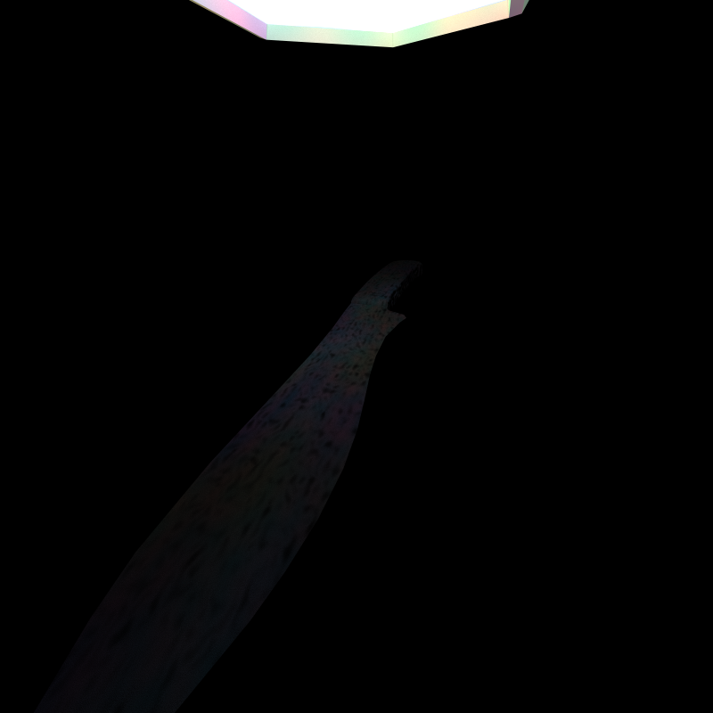
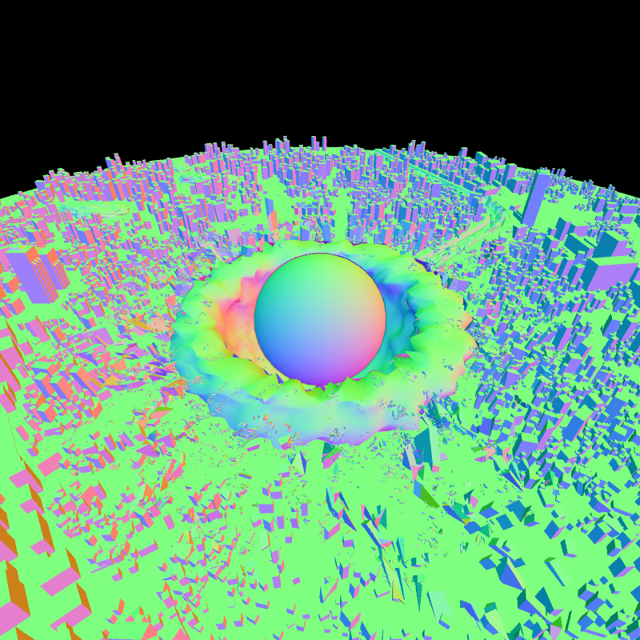

CUDA Path Tracer
================

**University of Pennsylvania, CIS 565: GPU Programming and Architecture, Project 3**





* Oliver Hendrych
  * [LinkedIn](https://www.linkedin.com/in/oliver-hendrych/)
* Tested on: Windows 11, i7-14700K @ 3.4GHz 32GB, RTX 4070 SUPER 12GB (Personal)


### Path Tracing

Path tracing is a technique for generating physically-plausible looking scenes. It follows the life of a ray as it is emitted from a camera, tracing as it bounces from one object to another, picking up light and color along the way. Due to its adherence to 3 principles of optics (i.e. Principle of Global Illumination, Principle of Equivalence, and Principle of Direction, summarized in [Kajiya's rendering equation](https://en.wikipedia.org/wiki/Rendering_equation)), it is able to render many scenes in a semi-photo-realistic way, producing high-quality images that are often used as bases to which other rendering techniques are compared. 


Due to the computationally intensive nature of path-tracing and its "embarrassing" parallelizability, it is often a target for GPU implementation. This project is one such instance of this technique, with a focus on loading meshes, textures, and normal maps via the Khronos Group's Graphics Library Transmission Format (glTF). This widely-available file format uses json, images, and binary files to specify all the information necessary to render a complex scene.

Utilizing [tinygltf](https://github.com/syoyo/tinygltf/) to important the data into C++, along with some custom structs to make the data more CUDA-friendly, the necessary information was pushed onto the GPU for parallel processing.

First, rays are generated from the camera's perspective, utilizing randomness to "jitter" the ray's perspective within a pixel, providing anti-aliasing.

Next, the closest intersection of every ray with the scene geometries is found. When a ray intersects a triangle, if it is the closest triangle found thus far, the intersection position, normal, and relevant texture coordinates are found using barycentric interpolation and stored. Meshes may be culled according to their axis-aligned bounding box, significantly reducing the computation spent on rays that don't interact with them. 


Then, each ray is shaded, meaning that the texture images are sampled to find the texture colorings and normal offsets, and applied as according to the glTF specification. As rays get this data according to the material of the mesh it intersected with, rays are first sorted by material, in order to reduce memory accesses. Additionally, rays' positions and directions are updated according to perfectly diffuse material quality. Rays that don't intersect with any mesh in the scene are filtered out in this step. 



Finally, the process repeats, finding the closest intersection of every updated ray, until a specified depth is reached. The whole process is repeated for a given number of iterations to reduce noise.

### Stream compaction

Stream compaction is the process of 

### Mesh loading

#### Bounding Volume intersection culling

### Texture Sampling

Texture sampling involves loading textures 

#### File loaded vs Procedural textures


### CMakeFiles Changes

#### Enable host constexpr
```set(CMAKE_CUDA_FLAGS "${CMAKE_CUDA_FLAGS} --expt-relaxed-constexpr")```

Originally added to allow the use of std::array indexing, but moved away from std::array in the end

### Attributions

Rendering equation image: Timrb, CC BY-SA 3.0 <https://creativecommons.org/licenses/by-sa/3.0>, via Wikimedia Commons