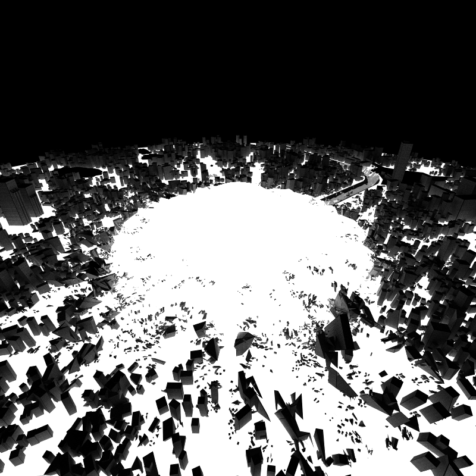
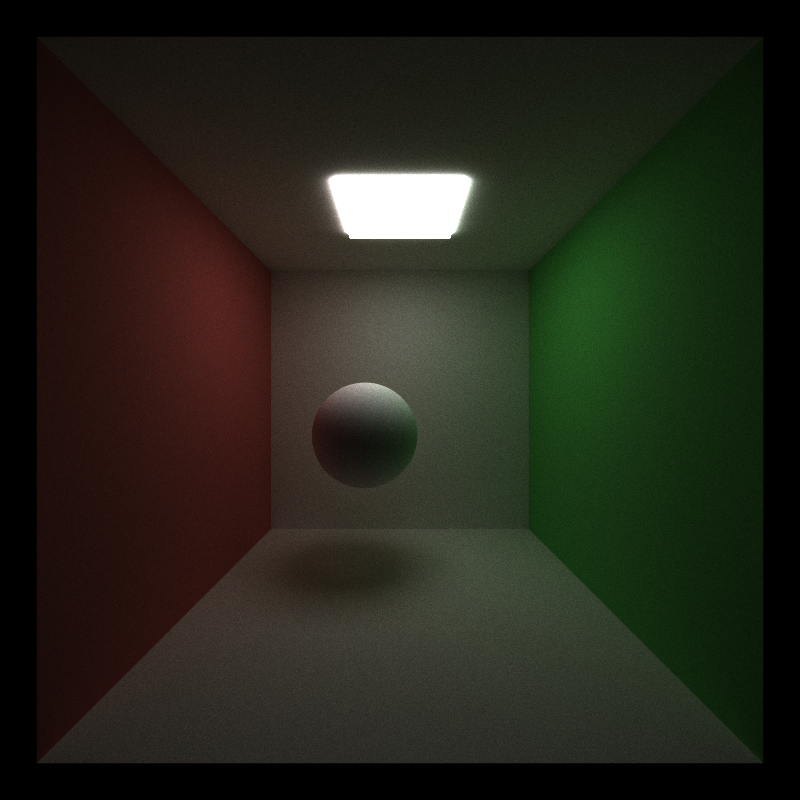

CUDA Path Tracer
================

**University of Pennsylvania, CIS 565: GPU Programming and Architecture, Project 3**


* Oliver Hendrych
  * [LinkedIn](https://www.linkedin.com/in/oliver-hendrych/)
* Tested on: Windows 11, i7-14700K @ 3.4GHz 32GB, RTX 4070 SUPER 12GB (Personal)


### Path Tracing

Path tracing is a technique for generating physically-plausible looking scenes. It follows the life of a ray as it is emitted from a camera, tracing as it bounces from one object to another, picking up light and color along the way. Due to its adherence to 3 principles of optics (i.e. Principle of Global Illumination, Principle of Equivalence, and Principle of Direction, summarized in [Kajiya's rendering equation](https://en.wikipedia.org/wiki/Rendering_equation)), it is able to render many scenes in a semi-photo-realistic way, producing high-quality images that are often used as bases to which other rendering techniques are compared. 


Due to the computationally intensive nature of path-tracing and its "embarrassing" parallelizability, it is often a target for GPU implementation. This project is one such instance of this technique, with a focus on loading meshes, textures, and normal maps via the Khronos Group's Graphics Library Transmission Format (glTF) 2.0. This widely-available file format uses json, images, and binary files to specify all the information necessary to render a complex scene.

Utilizing [tinygltf](https://github.com/syoyo/tinygltf/) to important the data into C++, along with some custom structs to make the data more CUDA-friendly, the necessary information was pushed onto the GPU for parallel processing.

First, rays are generated from the camera's perspective, utilizing randomness to "jitter" the ray's perspective within a pixel, providing anti-aliasing.

Next, the closest intersection of every ray with the scene geometries is found. When a ray intersects a triangle, if it is the closest triangle found thus far, the intersection position, normal, and relevant texture coordinates are found using barycentric interpolation and stored. Meshes may be culled according to their axis-aligned bounding box, significantly reducing the computation spent on rays that don't interact with them. 


Then, each ray is shaded, meaning that the texture images are sampled to find the texture colorings and normal offsets, and applied as according to the glTF specification. As rays get this data according to the material of the mesh it intersected with, rays are first sorted by material, in order to reduce memory accesses. Additionally, rays' positions and directions are updated according to perfectly diffuse material quality. Rays that don't intersect with any mesh in the scene are filtered out in this step. 


Finally, the process repeats, finding the closest intersection of every updated ray, until a specified depth is reached. The whole process is repeated for a given number of iterations to reduce noise.



### Stream compaction

Stream compaction is the process of removing elements from a list according to some criteria (and compacting the ones that remain to be contiguous). In this case, we are removing unterminated (i.e. did not intersect with scene geometry) rays from the array of all rays, so that terminated ones can be rescattered and processed until the depth limit. However, unterminated arrays may still have accured some colors in the bounces before they left the scene, so they cannot be fully discarded as may be the case in traditional stream compaction. Instead, the array of rays is partitioned, so that all unterminated rays appear at the end. This happens at each depth iteration, meaning as the size of still-active rays shrinks, the inactive rays collect at the end. Another approach could have been to write to the end color buffer with the unterminated rays, then perform proper stream compacting. The rays are compacted to coalesce global memory reads from threads within a block. Placing rays operated on by a block closer together reduces the number of global memory reads.

When sorting by material, the step of partitioning happens within the sorting. By assigning unterminated rays a material id beyond any actual material, they are automatically placed at the end of the array.


### Mesh loading

Support for triangle meshes in glTF 2.0 are supported. While testing for intersection with cubes and spheres allowed for some variety and complexity in scenes, general support for triangle meshes vastly widened the available models that could be rendered. The intersection between a ray and a mesh has a similar technique of transforming the ray into the mesh space, then computing the intersection between the ray and each triangle. 

Vertices in glTF 2.0 are stored in a binary buffer, which is loaded onto the gpu. To index into that and associated buffers, the indicies binary buffer is also loaded onto the GPU for indexing.

Sample scene before (simple cornell box):



Scene after:


The impact on performance was clear: more complex scenes resulted in more longer runtimes. Opening the door to arbitrary meshes also opened the door to arbitrarily large and complex meshes. As each thread is iterating over every triangle in a mesh to check intersection, the computation for each thread is dependent on the number of triangle. However, it is also dependent on the number of vertices. These two numbers can vary semi-independently as vertices used between triangles are generally not duplicated in the binary buffer holding the vertices. Therefore, more vertex sharing between triangles reduces memory overhead. On my machine (specs above), the limit was around 200k vertices and 100k triangles before windows started calling the program unresponsive (~6s per frame). 

A CPU version of this feature would theoretically move one of the essential and most parallelizable parts of the computation pipeline from the GPU to the CPU, introducing massive slowdown. While each triangle is handled sequentially on the GPU, each ray would also be handled sequentially on the CPU (which, while multithreading is available, pales in the number of cores available to the GPU). Additionally, since the output from the previous steps and the subsequent steps are on the GPU, device synchronizations and memory transfers before and after processing would be necessary. This part is massively improved from being on the GPU. 

The biggest optimization that could be applied to this feature would be a hierarchical data structure for checking intersection, such as a bounding volume hierarchy (BVH). Currently, every triangle in a mesh must be individually checked against an incoming ray to see if it intersects. In a BVH, the triangles are grouped in a (binary) tree structure such that, when checking intersection, an incoming ray must go from the root tree down one path to a leaf node. This changes the computation from scaling with the number of triangles, O(N), to scaling with O(log N). 

#### Bounding Volume intersection culling

While bounding volume hierarchies were not implemented, bounding volume intersection culling was. As part of the glTF 2.0 specification, each mesh must provide the minimum and maximum (along each axis) of the position vertices. Therefore, axis-aligned bounding boxes (using the axes of the mesh itself, post transformation), were implemented to disqualify entire meshes if it would found that a ray did not intersect with its bounding box. Combined with the scene-node-mesh structure of glTF 2.0 file, this opens fair opportunity for optimization, if scenes are constructed that heavily utilize this part of the specific.

### Texture Sampling (Color and Bump Mapping)

Texture sampling involves loading textures according to a file or a function based on position. Textures are commonly stored as images alongside the glTF file describing the scene. These images are then loaded into global memory to later be sampled when the shading of a ray occurs. Then, if the mesh contains texture coordinates, the relevant loaded image is indexed and the value retrieved. The texel coordinates are determined during the intersection - if the mesh contains texture coordinates, barycentric interpolation is used to properly interpolate the relevant vertices' texture coordinates to get smooth values across a triangle. The process for bump mapping is similar to color mapping. If the mesh contains a normal map, the image is loaded and the color space is transformed into the appropriate modifications to the found normal of the intersection. This is used to rescatter the array.

Here, we can see the normal having an effect to produce apparent ridges/wear in the blade. 


#### File loaded vs Procedural textures

While textures for color and normals can be stored in image files, they also also be generated procedurally. The upside of this is that it reduces memory usage and global memory reads. Therefore, procedural textures for colors and normals were introduced to compare relative  performance.


### CMakeFiles Changes

#### Enable host constexpr
```set(CMAKE_CUDA_FLAGS "${CMAKE_CUDA_FLAGS} --expt-relaxed-constexpr")```

Originally added to allow the use of std::array indexing, but moved away from std::array in the end

### Attributions

Rendering equation image: Timrb, CC BY-SA 3.0 <https://creativecommons.org/licenses/by-sa/3.0>, via Wikimedia Commons