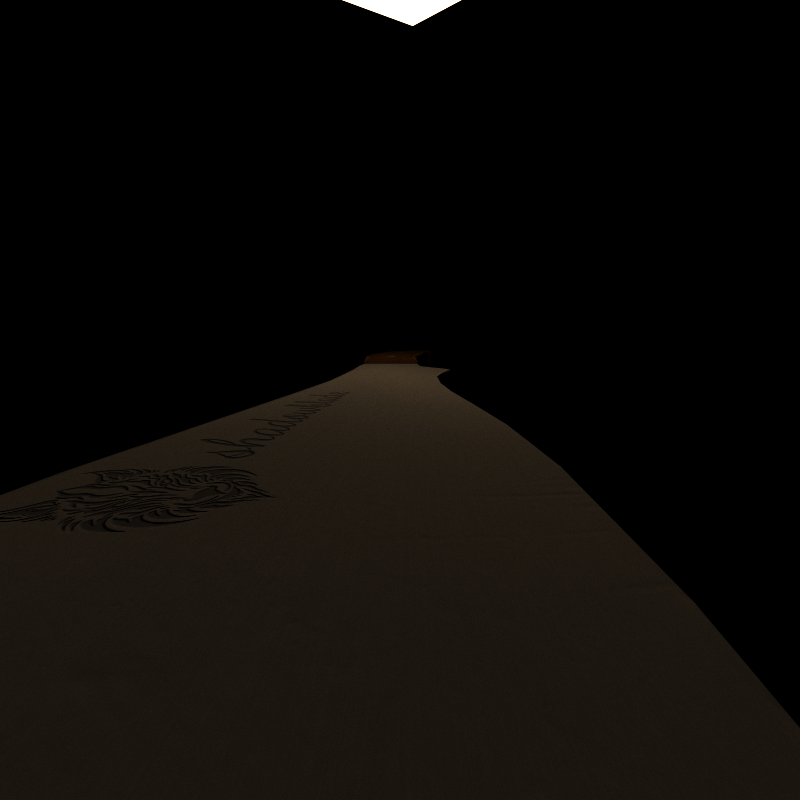
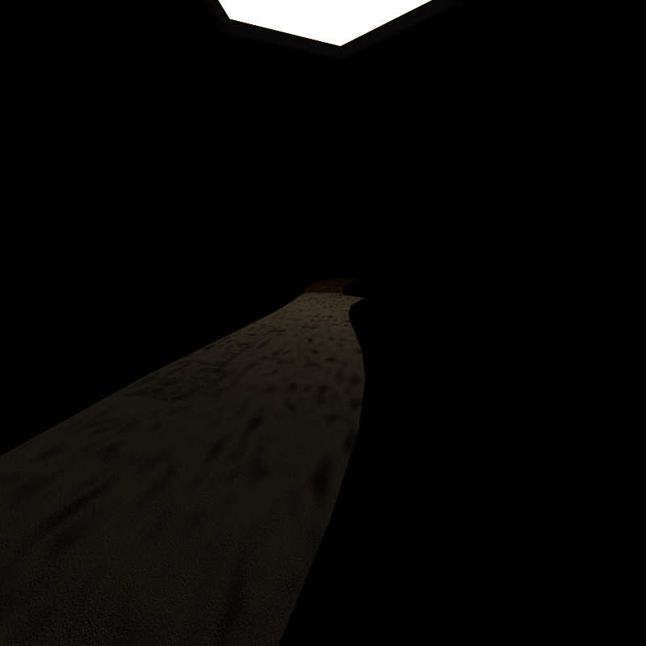
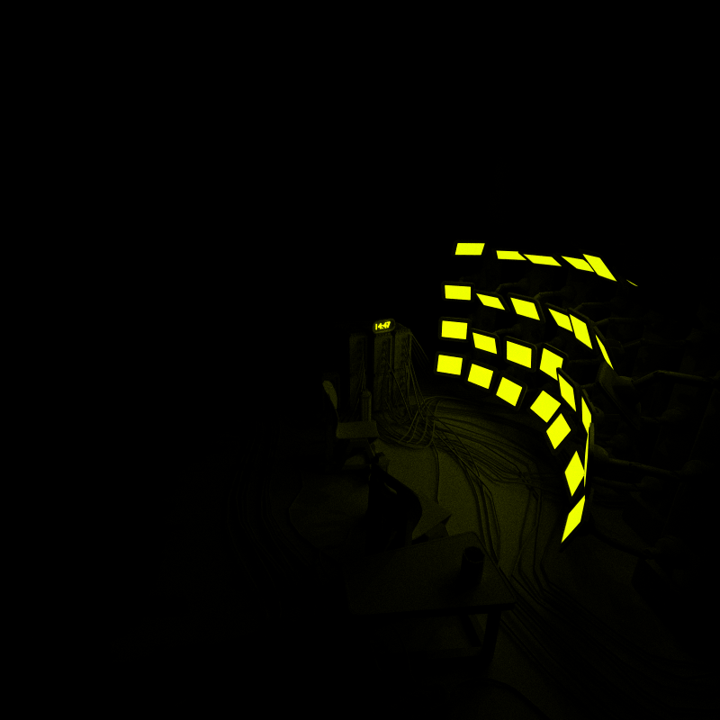

CUDA Path Tracer
================

**University of Pennsylvania, CIS 565: GPU Programming and Architecture, Project 3**






* Oliver Hendrych
  * [LinkedIn](https://www.linkedin.com/in/oliver-hendrych/)
* Tested on: Windows 11, i7-14700K @ 3.4GHz 32GB, RTX 4070 SUPER 12GB (Personal)


### Path Tracer

Arbitrary Mesh Loading and Rendering
* glTF 2.0
* tinygltf to load glTF 2.0 files
* toggleable boudning volume intersection culling (via macro)

Texture Mapping and Bump Mapping
* File-loaded color and normal textures
* Perlin noise procedural textures available (via macro)

### CMakeFiles Changes


#### Enable host constexpr
```set(CMAKE_CUDA_FLAGS "${CMAKE_CUDA_FLAGS} --expt-relaxed-constexpr")```

Originally added to allow the use of std::array indexing, but moved away from std::array in the end

#### Add tinygltf to header
    
```
set(headers
    ...
    src/tiny_gltf.h
)
```